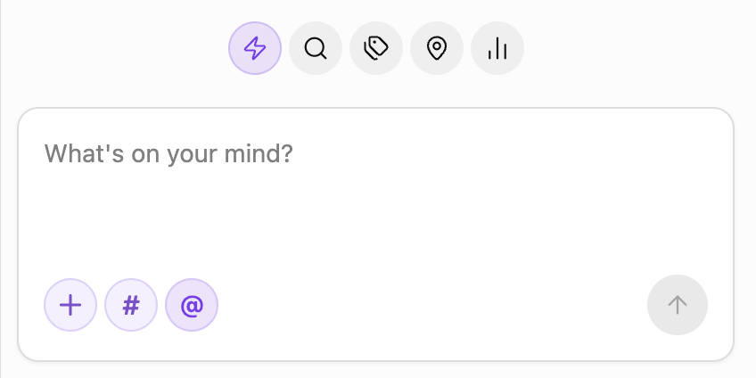
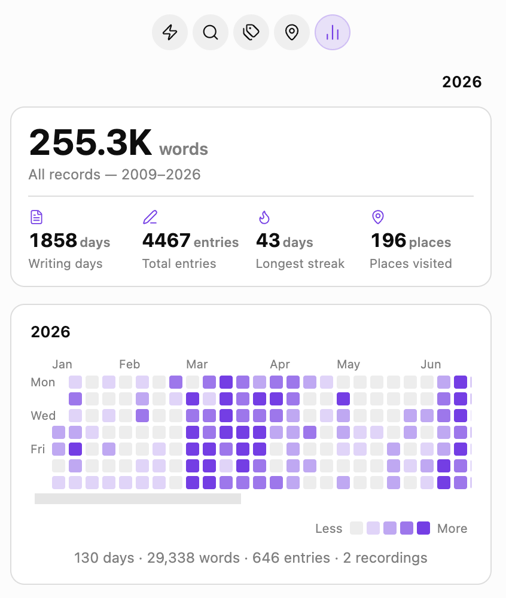

# Spark Memo

> **Catch every spark, before it fades.**

An Obsidian plugin for journaling — built around two ideas:

1. **Shoot first, write later.** Drop a photo into the sidebar and Spark Memo reads its EXIF capture time and GPS location, then writes the memo as if you'd jotted it down back then, at that place — the same experience Day One gave you, now inside your Obsidian vault.
2. **Never lose the thought.** The quick-capture sidebar is always one click away: type, dictate, paste an image, or hit record — the memo lands in today's daily note before the moment passes.

Under the hood it highlights `HH:MM` timestamps inside a designated Memo section, and rolls up everything you've written into a **yearly heatmap** so you can look back on the whole year at a glance.

> Originally forked from [zhaohongxuan/journal-partner](https://github.com/zhaohongxuan/journal-partner). Thanks to the original author for the timestamp-highlighting core.

---

  
  &nbsp;
  

---

## Features

- **Timestamp highlighting** in the `## Memo` section — pill badges in Source, Live Preview, and Reading view, with customizable colors and an optional read-only mode
- **Quick-capture sidebar** — write, dictate, paste images, or record audio; entries are appended to today's daily note under `## Memo`
- **Photo-driven memos** — pasted or uploaded images with EXIF time / GPS are turned into memos at the original moment and place, stored as `[Name](geo:lat,lon)` links
- **Tag & location roll-ups** — every `#tag` and every geo-tagged memo grouped for review, with rename / merge / delete for tags
- **Yearly heatmap** — GitHub-style grid per year, with total words, writing days, entry count, and longest streak
- **Random rewind** — open the Search tab and a random past memo greets you, so old thoughts get another moment in the light
- **Multi-language** — follows Obsidian's UI language (English / 简体中文)

Requires Obsidian's built-in **Daily Notes** core plugin.

---

## Installation

Once the plugin is accepted into the community catalog, install it from **Settings → Community plugins → Browse → "Spark Memo"**.

Manual install: download `main.js`, `manifest.json`, and `styles.css` from the latest [GitHub Release](https://github.com/houjoe0829/sparkmemo/releases) into `<vault>/.obsidian/plugins/spark-memo/`, then enable it in Settings → Community plugins.

---

## Usage

1. Click the feather-pen icon in the ribbon (or run **"Open Quick Capture sidebar"** from the Command Palette) to open the sidebar
2. Type into the input, then click submit — the memo is written to today's daily note as `- HH:MM text`
3. Paste an image or hit record to attach media; images with EXIF time / GPS will prompt you to use their moment and place
4. Switch to the `Search` / `Tags` / `Locations` / `Stats` tabs to browse across days

---

## License

MIT
